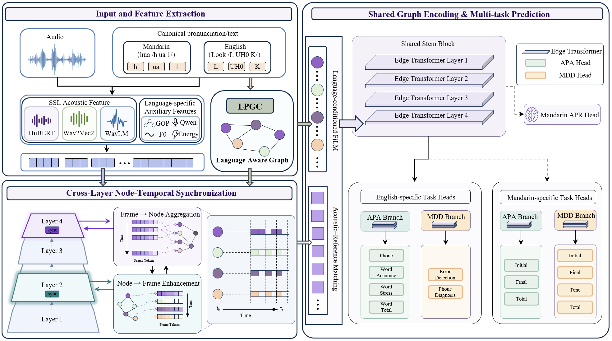

# LAPG

**Paper:** *Language-Aware Pronunciation Graphs for English–Mandarin Pronunciation Assessment and Diagnosis*  
**Abbreviation:** **LAPG**

This repository is the official code for LAPG: language-aware graph neural networks for bilingual CAPT (Computer-Assisted Pronunciation Training), covering pronunciation **assessment (APA)** and **mispronunciation detection & diagnosis (MDD)**.

| Track | Corpus | Graph | Main entry |
|-------|--------|-------|------------|
| **CN** | Mandarin single-syllable CAPT | Initial → Final → Tone → Global | `CN/train_graph.py` |
| **EN** | SpeechOcean762 | Phone ↔ Word | `EN/train_speechocean2.py` |

Core idea: **language-specific pronunciation graphs** + multi-task MDD / APA (+ CN ASR), with SSL / Qwen FiLM fusion and cross-layer Sync.



---

## Repository layout

```
LAPG/
├── README.md                 # this file
├── main.png                  # model overview figure
├── requirements.txt          # pip deps (from conda env GNN)
├── environment.yml           # conda env create
├── CN/                       # Chinese experiments
│   ├── train_graph.py
│   ├── run_seeds.sh
│   ├── data/                 # labels only
│   ├── caches/               # FA / F0 / Energy (small)
│   └── features/             # SSL features (see note below)
└── EN/                       # English experiments
    ├── train_speechocean2.py
    ├── run_seeds.sh
    ├── data/
    ├── caches/
    ├── gop_feature/          # Kaldi GOP + seq energy/dur (if included)
    ├── resource/vocab_merge.json
    └── features/             # SSL features (see note below)
```

More file-level notes: `CN/代码文件说明.txt`, `EN/代码文件说明.txt`.

---

## Features download (important)

`CN/features/` and `EN/features/` contain pre-extracted SSL / Qwen frame features (HuBERT, Wav2Vec2, WavLM, Qwen).  
They are **too large for GitHub** (CN ≈ 7G, EN ≈ 13G), so they are **not fully uploaded** with this repo.

**To obtain the feature packs**, please contact the author / open a GitHub Issue and request the download link.  
After download, place them as:

```text
LAPG/CN/features/{hubert_feature,tencent_wav2vec2_feature,wavlm_feature,qwen_feature_14layer}/
LAPG/EN/features/{hubert_feature,tencent_wav2vec2_feature,wavlm_feature,qwen_feature_14layer}/
```

Training also expects caches under `CN/caches/` and `EN/caches/` (and EN `gop_feature/` when using GOP phone/word features). If any of these folders are missing from your clone, ask together with the feature pack.

---

## Environment

Dependencies are pinned to our reference conda env **`GNN`** (Python **3.10.20**, CUDA **12.8**).

| File | Purpose |
|------|---------|
| `requirements.txt` | pip pins (full GNN-relevant stack) |
| `environment.yml` | `conda env create` |

**Train with precomputed features/caches** needs: `numpy`, `torch`, `torch-geometric`.  
Audio / scientific packages (`librosa`, `soundfile`, `torchaudio`, `scipy`, `pandas`, …) are included because they are installed in `GNN` and used when regenerating FA/F0/Energy or SSL features.

```bash
# Option A: conda
conda env create -f environment.yml
conda activate LAPG

# Option B: pip (install CUDA PyTorch first)
pip install torch==2.11.0 torchaudio==2.11.0 torchvision==0.26.0 \
  --index-url https://download.pytorch.org/whl/cu128
pip install -r requirements.txt
# If torch-geometric fails, see:
# https://pytorch-geometric.readthedocs.io/en/latest/install/installation.html

export PY=python3
# or: export PY=/path/to/conda/envs/GNN/bin/python
```

Reference pins in `GNN`: `torch/torchaudio 2.11.0+cu128`, `torchvision 0.26.0+cu128`, `torch-geometric 2.7.0`, `numpy 2.2.6`, `librosa 0.11.0`, `scipy 1.15.2`, `pandas 2.3.3`, `scikit-learn 1.7.2`.

---

## Run

All paths are **relative** to `CN/` or `EN/`. Outputs go to `exp/seed{N}/`.

### Chinese (CN)

Default seeds (by `apa_mean_pcc`): `180 265 70 226 12`

```bash
cd CN
CUDA_DEVICE=0 ./run_seeds.sh
# or a subset:
CUDA_DEVICE=0 ./run_seeds.sh 180 265
```

### English (EN)

Default seeds (main table): `173 185 79 237 239`

```bash
cd EN
CUDA_DEVICE=0 ./run_seeds.sh
# or a subset:
CUDA_DEVICE=0 ./run_seeds.sh 173 185
```

---

## Citation / contact

If you use this code, please cite:

> Language-Aware Pronunciation Graphs for English–Mandarin Pronunciation Assessment and Diagnosis (LAPG).

For **feature download** or reproduction questions, open a GitHub Issue or contact the author.
